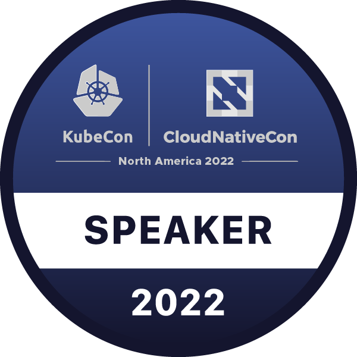

## Welcome!
- 🔭 I’m currently working on [Syft](https://github.com/anchore/syft), [Grype](https://github.com/anchore/grype), and [Grant](https://github.com/anchore/grant)
- 🌱 I’m currently learning about [GGUF](https://github.com/ggerganov/ggml/blob/master/docs/gguf.md) files. GGUF is a format for storing models for inference with GGML
- 👯 I’m looking to collaborate if you're in need of a Rust or Golang developer
- 📫 How to reach me: Here is my [website](https://cphillips.io)

<!--
**spiffcs/spiffcs** is a ✨ _special_ ✨ repository because its `README.md` (this file) appears on your GitHub profile.

Here are some ideas to get you started:

- 🔭 I’m currently working on ...
- 🌱 I’m currently learning ...
- 👯 I’m looking to collaborate on ...
- 🤔 I’m looking for help with ...
- 💬 Ask me about ...
- 📫 How to reach me: ...
- 😄 Pronouns: ...
- ⚡ Fun fact: ...
-->
